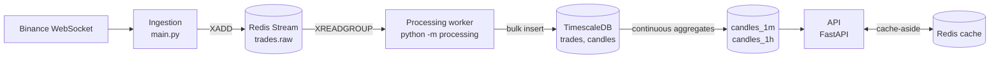

# CryptoStream

A real-time market data pipeline for crypto trades. It ingests live trades from
exchange WebSockets, buffers them in Redis Streams, stores them in
PostgreSQL/TimescaleDB, aggregates them into OHLCV candles, and serves candles and
per-symbol stats over a FastAPI REST API.

Analytics only: no trading, no order placement, no funds.

> **Status:** work in progress. Binance trades flow end to end, through storage and
> candle aggregation, and the REST API serves `/candles`, `/stats` and `/health`.
> Coinbase and Kraken, the `/live` WebSocket, metrics and CI are still to come (see
> [Roadmap](#roadmap)).

## Architecture

Three independent processes that share no in-process state and talk only through
Redis and Postgres, so each one can be restarted or scaled on its own.



**Ingestion** (`main.py`, `ingestion/`) subscribes to Binance `@trade` streams and
normalizes every message into one internal `Trade` model (`domain/trade.py`). It
writes the trades to the `trades.raw` Redis stream in batches. Lost connections are
retried with exponential backoff. Backpressure is explicit: the in-process queue is
bounded, so when Redis falls behind, ingestion stops reading the socket rather than
buffering without limit or dropping trades.

**Processing** (`processing/`) reads `trades.raw` as a Redis consumer group, so any
number of workers can split the stream. Each batch is bulk-inserted into Postgres and
only acknowledged after the write, which gives at-least-once delivery. Duplicates
become no-ops through `ON CONFLICT DO NOTHING` on the primary key
`(ts_event, exchange, trade_id)`. On startup, a recovery sweep reclaims entries that a
crashed worker read but never acknowledged. Entries that keep failing go to the
`trades.dlq` stream. The worker also builds 1-minute candles in memory for a
low-latency view.

**Storage** (`storage/`) uses TimescaleDB:

| Object | Purpose |
|---|---|
| `trades` hypertable | Raw ticks. Compressed after 1 day, dropped after 7 days. |
| `candles` hypertable | Candles written by the worker. |
| `candles_1m`, `candles_1h` | Continuous aggregates recomputed from `trades`. Refreshed every minute and every hour, in real-time mode, so the newest bucket is always included. `candles_1h` is built on `candles_1m`. |

The API reads the continuous aggregates, not the worker's table. They are recomputed
from the raw trades, so they stay correct regardless of how many workers run or when
one restarts. Every schema change is an Alembic migration.

**API** (`api/`) is a FastAPI service with Pydantic request and response models,
keyset pagination, and a Redis response cache. The cache TTL depends on how settled
the data is: a short TTL while the newest candle can still change, a longer one once
it has closed. If Redis goes down, requests are served straight from Postgres.

## Getting started

### Prerequisites

- Python 3.12 or newer
- Docker with Docker Compose

### Setup

```bash
python -m venv .venv
.venv/bin/pip install -r requirements.txt
cp .env.example .env
```

Fill in `.env`. Docker Compose reads the same file, so the values you pick here are
the credentials the containers are created with:

```dotenv
DB_NAME=cryptostream
DB_USER=cryptostream
DB_PASSWORD=change-me
DB_HOST=localhost
DB_PORT=5433
REDIS_HOST=localhost
REDIS_PORT=6379
REDIS_PASSWORD=change-me
TRADE_WORKER_CONSUMER=worker
TRADE_RECOVERY_CONSUMER=recovery
API_HOST=127.0.0.1
API_PORT=8080
```

The remaining `API_*` and `CANDLE_*` variables have working defaults in
`.env.example`. `API_SYMBOLS` lists the pairs the API serves per exchange, as JSON.

Both containers publish their ports on `127.0.0.1` only.

### Run

```bash
make run       # start Postgres and Redis, apply migrations, run ingestion and the worker
make run-api   # in a second terminal: the API, with auto-reload
```

`make run` runs `launch.sh`. The script waits for the containers to become healthy and
brings the schema to the latest migration before starting anything. If either service
exits, it stops the other one too. Ctrl+C shuts both down gracefully: queued trades
are flushed to Redis first.

Interactive API docs are served at `http://127.0.0.1:8080/docs`.

## API

All timestamps must carry a UTC offset and are returned in UTC with a `Z` suffix.
Prices and quantities are returned as JSON strings, so no precision is lost to
floating point. Unknown query parameters are rejected with a 422.

### `GET /candles`

OHLCV candles for one pair, newest first, paginated by cursor.

| Parameter | Required | Description |
|---|---|---|
| `exchange` | yes | `binance` |
| `symbol` | yes | Normalized pair, e.g. `BTC-USDT` |
| `interval` | no | `1m` (default) or `1h` |
| `ts_from` | yes | Inclusive start of the window |
| `ts_to` | yes | Exclusive end of the window |
| `limit` | no | Candles per page, default 100, max 1000 |
| `cursor` | no | `next_cursor` from the previous page |

```bash
curl -G http://127.0.0.1:8080/candles \
  --data-urlencode exchange=binance \
  --data-urlencode symbol=BTC-USDT \
  --data-urlencode interval=1m \
  --data-urlencode ts_from=2026-09-25T00:00:00Z \
  --data-urlencode ts_to=2026-09-26T00:00:00Z
```

The response holds `candles` and `next_cursor`. `next_cursor` is `null` on the last
page. Otherwise, send it back unchanged as `cursor` to fetch the next page. Pagination
is keyset-based, not `OFFSET`, so every page costs the same however deep you go.

### `GET /stats/{symbol}`

Last price, volume and VWAP for one pair over a window.

```bash
curl -G http://127.0.0.1:8080/stats/BTC-USDT \
  --data-urlencode exchange=binance \
  --data-urlencode ts_from=2026-09-25T00:00:00Z \
  --data-urlencode ts_to=2026-09-26T00:00:00Z
```

Returns `last_price`, `volume`, `vwap` and `as_of` (the latest minute with trades),
along with the window it covers. VWAP is exact over any window: the aggregates store
the total traded value and the total quantity per bucket, and VWAP divides one by the
other at query time.

A pair that isn't configured in `API_SYMBOLS` gets a 404 listing the valid pairs.
`/stats` also returns a 404 when the window has no trades.

### `GET /health`

Checks Postgres and Redis concurrently, with a one-second timeout each. Returns 200
when both answer and 503 otherwise, with the status of each dependency.

## Development

```bash
make help              # list targets
make check             # lint, format check, mypy --strict, unit tests
make test-integration  # integration tests (needs Docker)
make check-all         # both
```

- **Typing:** `mypy --strict` across the whole codebase.
- **Linting and formatting:** `ruff`.
- **Unit tests** need no network or database. Property-based tests (`hypothesis`)
  cover the aggregator and cursor pagination.
- **Integration tests** use `testcontainers` to start a throwaway TimescaleDB and
  Redis, apply the real migrations, and exercise the pipeline end to end: crash
  recovery, idempotent redelivery, load splitting across workers, and agreement
  between the worker's candles and the continuous aggregates.
- **Logs** are structured JSON from `structlog`. Event names follow
  `subsystem.event` and are defined once in `core/log_events.py`.

### Migrations

```bash
.venv/bin/alembic upgrade head
.venv/bin/alembic revision --autogenerate -m "describe the change"
```

Review every autogenerated migration before applying it. Autogenerate doesn't
understand TimescaleDB objects such as continuous aggregates and policies, so those
are written by hand.

## Project layout

```
core/         shared config, logging, Redis client, retry and backoff
domain/       Trade and Candle models, enums
ingestion/    exchange WebSocket client and normalizers
processing/   consumer-group worker and streaming candle aggregator
storage/      SQLAlchemy models, repositories, aggregate views, Alembic migrations
api/          FastAPI app: routers, schemas, cache, pagination, settings
tests/        unit/ and integration/
docker/       Redis config
main.py       ingestion entrypoint
launch.sh     runs the stack: containers, migrations, ingestion and worker
```

Dependencies point inward: `domain` imports nothing from the other layers, `storage`
builds on `domain`, and the services build on both.

## Roadmap

1. [x] **Spine:** Binance trades to the console
2. [x] **Persist:** Postgres, SQLAlchemy, Alembic, pytest
3. [x] **Decouple:** Redis Streams between ingestion and the worker
4. [x] **Aggregate:** candle aggregator, hypertables, continuous aggregates
5. [ ] **Serve:** REST API with caching *(in progress)*
6. [ ] **Realtime:** `/live` WebSocket fan-out
7. [ ] **Scale:** Coinbase and Kraken, multiple workers, profiling
8. [ ] **Harden:** Prometheus and Grafana, CI, full Docker Compose stack, load tests,
   retention and backfill jobs
9. [ ] **Stretch:** Kafka, Kubernetes, anomaly detection
